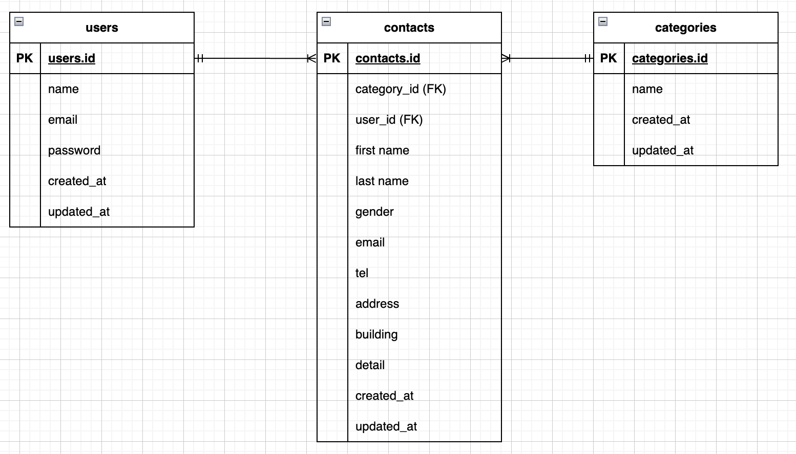

# Confirmation-test

## アプリケーション概要

お問い合わせフォームアプリケーション

## 環境構築

### Dockerビルド

1. git clone https://github.com/masahiro1234-us/Confirmation-test.git
2. cd Confirmation-test
3. docker-compose up -d --build

### Laravel環境構築

1. docker compose exec php bash
2. composer install
3. php artisan key:generate
4. php artisan migrate
5. php artisan db:seed

## 使用技術（実行環境）

- PHP 8.0.26
- Laravel 10.30.0
- MySQL 8.0.26
- Docker Desktop 4.x

※バージョンは `composer.json` や `docker-compose.yml` から確認

## ER図

## URL

- 開発環境トップページ: http://localhost/
- ログインページ: http://localhost/login
- 会員登録ページ: http://localhost/register
- お問い合わせ確認ページ: http://localhost/confirm
- 完了ページ: http://localhost/thanks
- 管理者ページ: http://localhost/admin
- phpMyAdmin: http://localhost:8080/

## phpMyAdmin ログイン情報

- サーバー名: mysql
- ユーザー名: root
- パスワード: root